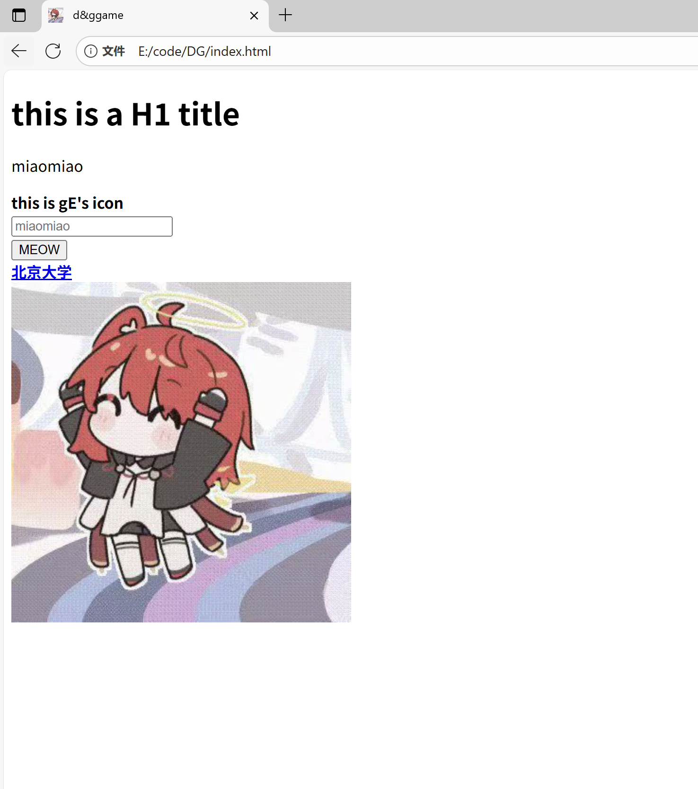
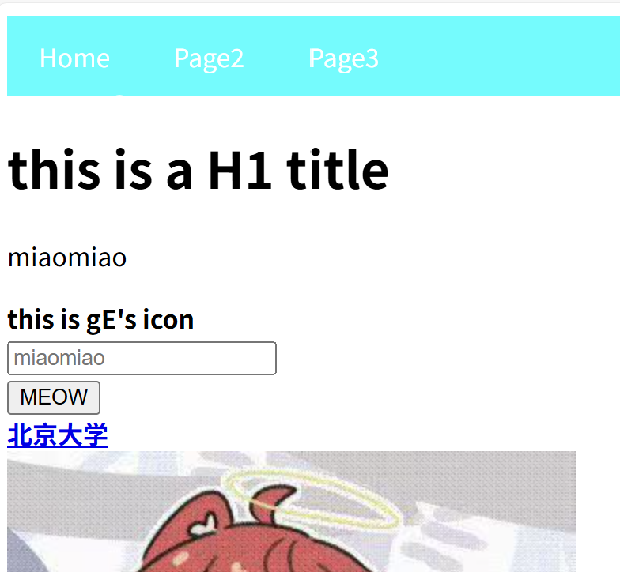
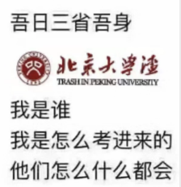

<span style="color: green;">
绿色部分为gE回顾这两周时加上的批注(
</span>
# Pre

又找了齐神, 但他似乎没我那么闲, 况且不知道这个坑多深, 就拉人往里跳是不负责的, 遂打算自己先做一个试试水. <span style="color: green;">明智的决定</span>

选题是做一个**网页版的画板**, 是 GPT 给出的候选中技术栈较为复杂的一个, 包括

- 前端的 HTML, CSS, JS
- 后端的 Nodejs, Express
- 实时通信的 SocketIO
- 框架&绘图的 React, Canvas
- 部署的 Vercel, Render

这里面大多数名词 gE 都没听说过, 希望 LLM 提供资源能给点力

---

继续让 GPT 分配了每周要干啥&每天的任务, 发现第一周的任务量多得有点吓人, 后来发现学得太基础了, 遂采取 GPT 的建议, 每天生成一个 BOSSTask, 完成这个任务即标志接下来不再需要学习该领域的知识.  
<span style="color: green;">一天学成 "不需要复习" 是不可能的, 最多知道它能干嘛&怎么用, 细节还得问 LLM</span>

# The Short Journey

## Day 0 HTML

---

### BOSS TASK：**做一个完整的“个人主页”**

结构：

- 顶部有导航栏（“关于我”、“项目”、“联系我”）
- 中间有一张图片和简介文字
- 下方有一个表单（输入名字、留言、提交按钮）
- 页面有多个分区（`<header>`, `<main>`, `<footer>`）
  要求：
- 所有文字、图片、按钮可见
- 表单字段能输入内容
- 点击“提交”按钮时跳转到感谢页面（`thankyou.html`）

---

### Diary

gE 需要承认, 在刚看到这个任务时, 它是很崩溃的
几周前, gE 刚入门 git 时, folk 了学长一个类似的项目: [gE0650.github.io](https://gE0650.github.io), 当时 gE 还不会 markdown, 对着一大堆超链接还有各种路径设置, 头疼了好几天才看懂.

行吧, 反正那个项目难在部署, 只写 html 应该不难, 希望 3h 能搞定  
<span style="color:green;">
天哪, 这两个东西根本不是一个量级的. 我为什么会把他们俩相互比较, 真是井底之蛙  
</span>

---

先复习一下 html 基本知识



OK, 接下来加导航栏, 怎么加呢, 问 GPT
把生成的结果抄上来, 又问了每一行是什么意思

```css
nav /*控制导航栏*/
{
    background-color: #00ffff;
    overflow: hidden;
}
nav a /*控制文字&导航块间距*/
{
    float: left;
    display: block;
    color: white;
    text-align: center;
    padding: 14px 20px;
    text-decoration: none;
}
nav a:hover /*鼠标悬浮变色*/
{
    background-color: #0000ff;
}
```

修改了颜色, 结果如下



之后再加页脚 footer, 写表格...
最后结果

<video src="../images/rjimg/10.11-3.mp4" controls width=700>
</video>
<span style="color: green;">666, 配色真无敌了</span>

---

### Retro

今天大概花了 3.5h 搞这些东西. 接下来连续两个月都要这样, 每天花掉至少一半课余时间, 先看看吧, 如果影响学业就得暂缓/放弃了.
<span style="color: green;">一语成谶</span>

## Day 1 CSS

### BOSS TASK：**还原一张网页设计图（静态）**

任务描述：

选择一张简单的网页样图

要求：

- 使用纯 CSS（不允许使用框架）
- 网页在桌面端和手机端都保持良好布局（简单响应式）
- 所有元素位置、颜色、间距、对齐与设计图接近（误差 <10px）

---

### Diary

今天开始上强度了, CSS 没学过, 对着 MDN 的 Webbook 自学, 学了一个多小时就感觉头晕眼花.  
<span style="color: green;">自己学得太急了, 即便是 Webbook 还是不够易于上手</span>
发现了前端"刷题"网站
<a href="https://www.frontendmentor.io/">Frontend Mentor</a>
<span style="color: green;">后来没再看过</span>
从 9:30 开始, 到现在已经下午 1:00 了, 学了不少东西, 但 BOSSTask 还没上手, 先去吃午饭&去湖边逛一圈, 回来再选样图&复刻.

下午 3:00, 回到电脑, 打算复刻某官网.
3:57, 整好了上导航栏的渐变和背景图.
4:16, 整好了侧边栏和页脚.
**好丑啊**
4:30 发现一个 bug, 导致侧边栏被 footer 盖住
4:57 修正 bug
有点累,先这样吧
5:03 给侧边栏做了神经小动画

<video src="../images/rjimg/10.12-1.mp4" controls width=700>
</video>

显然, 虽然投入了 4h, 复刻远非完美, 甚至远非及格, 手机上的排版更是惨不忍睹. 不管怎样, gE 得先卷一卷高代数分了.

---

## Day 2 Javascript

### 🎯 BOSS TASK：**做一个简易计算器**

功能要求 👇：

🧮 页面包含：

- 数字按钮（0–9）
- 运算符按钮（+、-、×、÷）
- 显示屏
- 清除键（C）

🔢 功能：

- 点击按钮能实时更新显示屏
- 能计算并显示结果（例如 2+3×4=14）
- 能清空输入内容
- 错误输入（如 `++`）能被处理或忽略

---

### Diary

今天总算是从表示的语言转变为正经的 Programming Language 了, gE 不会 Java, 但语法应该和 C++差不多, 希望不要太难.
<span style="color: green;">后来才知道 Java 和 JS 关系不大</span>
先用 CSS 写了计算器的外观, 又遇到了昨天的 bug, 花了大半个小时才搞定.  
JS 的**事件触发**和常规语言从前往后执行有很大不同, 感觉有点像 Scratch.

---

用时 2.5h, 写出了一稿, 似乎有巨量 bug, 打算学习的**DOM 操作, 事件和调试**也是一点没学. 有点懵, **我已经浪费了两个半小时?**

<video src="../images/rjimg/10.13-1.mp4" controls width="600"></video>

改了 bug, 现在能用了.

---

## Day 3 DOM

### 🎯 BOSS TASK：**Todo List（待办清单）**

要求 👇：

📋 功能：

- 输入任务内容 → 点击添加 → 任务出现在列表中
- 每个任务可打勾（完成）或删除
- 刷新页面后任务仍然存在（使用 `localStorage` 保存）

---

今天主要还在了解 JS 语言.
发现 JS 语言可以**修改写好的 HTML 文件**, 真是太神奇了. 于是重构了文件, 试图让它便于维护, 花了 2h+
浏览器 fetch 本地文件似乎有安全警告, 遂安装插件**_Live Server_**, 可以在本地开服务器.

19:00 继续整
重构后发现几个 bug, 最有趣的是由于不同 scripts 加载顺序不同, 可能出现类似 c++中**先调用后定义**的问题, 解决方法类似于**把调用加载在定义它的文件里**.

19:33 开始做今天的任务
先构架 UI, 发现重构时很多 css 代码混在最开始的文件, 留到之后吧, 希望不要有什么冲突.

20:47 出现了之前的 CSSbug, 大概又要浪费半个小时, 任务留到明天吧.

---

## Day 5 Node.js

### 🎯 BOSS TASK：**用 Node.js 搭一个小型留言板**

功能 👇：

📨 用户：

- 在网页上填写昵称与留言
- 提交后留言显示在网页底部

后端：

- 使用 Express 接收表单数据
- 把留言存储在服务器内存数组中
- 返回完整 HTML 页面（或 JSON）

---

### Diary

先花了一个多小时把昨天的任务栏做完了, 效果如下

<video src="../images/rjimg/10.15-1.mp4" controls width="600" />

计概还有 30min+, 不知道够不够入门今天的内容. 看起来有点难.
**去他的留言板, 反正原理和任务栏差不多, 重复的 CSS 工作就不做了**
<span style="color: green;">但最后还是做了</span>

---

突然想起来昨天的**local storage**好像没做, 待会补一下.  
<span style="color: green;">然后就没补过, Express 也是</span>

---

## Day 6

### Diary

目前已经落后计划整整一天了, 这个计划有点太快了, 希望落后几天没什么问题. <span style="color: green;">自我安慰</span>
安装 nodejs 好复杂啊, 需要先装 docker, 装 docker 还要先开虚拟机, 早知道之前直接开 WSL2 好了.  
花了 2 小时装好了这些东西, 发现完全不知道从哪里入手. 打算先重新组织一下文件, 把之前的东西打包放到 frontend/里, 结果**路径全乱了**, 略感红温.

---

## Day 7

### Diary

正着学需要的基础知识太多了, 打算换一种**从答案反推原因**的学习方法. 先让 GPT**生成一份 MVP (最小价值产品) 代码**, 再**让它逐词解释** <span style="color: green;">其实就是抄作业</span>

一个半小时, 写了一个 server.js, 一个 router, 感觉明白了很多原理, 当然, 代价就是**代码实现能力为零**

下午 1 点, 继续开整. 开始写 controller
2:41, 终于让后端开始运行了, 途中遇到了各种各样的错误, 从 404 到 500, 最后到 200, 201.  
成果如下

<video src="../images/rjimg/10.17-2.mp4" controls width="800" />

另外, 视频中模拟服务器的 VScode 插件是**REST Client**

Day 5 的任务太难了, 明天开始搞前后端配合, 感觉又得花上两三天.

---

## Day 8

### Dairy

在 1024 文化节摆摊, 啥也没干.

回宿舍突然发现 github 多了一堆图片, 原来是把图片保存到这个项目的工作文件夹里了. 我还给 push 上去了, git 能回退吗.

---

## Day 9

### Diary

感觉 day6 的任务比 day 5 简单. 后来发现自己搞错了.  
GPT 原本 Day 5 让我做一个传统的 **请求-响应-渲染** 工作模式, 后端返回**整个 html 文件**, Day 6 再进化到现代的 **JSON 通信**, 即后端只返回 JSON 文件, 前端自己加载 html.
但是 gE 实现 Day 5 用的就是 JSON, 于是可以跳过 Day 6, 直接部署了.

哦不对, 我 Day 5 好像还没做完, 先把它整完吧.

---

上午打算整理一下文件, 把路径全都修正, 结果遇到了 Live Server 根目录乱动的问题. 浪费了大半个小时

下午继续弄,发现了一个很头大的问题: **Javascript 脚本需要在 HTML 动态加载完后再执行, 但脚本里有监听 DOMContentLoaded 的函数, DOMContentLoaded 又只会在动态加载前出现一次**,
解决方案很暴力, 直接去掉了 DOMContentLoaded, 把里面的东西直接堆在最外层, 希望不会影响后续&可维护性.  
总算完成前后端的联动了, 结果如下

<video src="../images/rjimg/10.19-1.mp4" controls width="800" />

_解释一下和 Day 5 的区别: Day 5 输入的数据是直接存在**本地浏览器的内存**里的, 刷新之后会丢失, 只能在一台设备上看. 现在的数据是存在**后端的 data.json**里的, 前端只负责加载, 故刷新后不会丢失, 其他设备也能看见_

---

## Day 10

### Diary

做了评论区, 加了 markdown 预览, 到下午 2 点了, 先去吃午饭

待会再修改一下导航栏就可以部署了

<span style="color: green;">后来发现 GPT 的部署方案只能部署静态网页, 这种带后端的需要报备&买服务器, 又担心期中数分挂科, 遂废弃项目</span>

---

# Retro

<div style="color: green;">
好的方面,  <br>
首先确实学到了不少东西, 几种语言的语法 (虽然是最最基础简单的部分) , 如何管理文件以及写路径(咬牙切齿) <br>
其次验证了这种高度依赖LLM的学习方法的可行性 (至少在入门阶段). 与其啃书 (包括webbook), 不如在Github上找一个项目, 并让LLM解释每一行是干什么, 甚至让LLM生成一个MVP.  <br>
<br>
不好的方面, <br>
首先是耗时有点多, 虽然根本原因是想速成, 但每天3h+已经比数分高代用时多了<br>
其次是有点太依赖LLM了, 这个项目浅尝辄止, 以后学更深的东西, 不知道LLM跟不跟得上<br>
选题问题也很大, 技术栈广而浅, 只能浅尝辄止, 与其说学习还不如说是玩电脑. 下次 (如果有) 应该仔细考虑选题的<br>
<br>
反思一下, 搞这个动机或许还是焦虑&maybe攀比. 还是祭出这张图吧
</div>



<span style="color: green;">
也是整活未半而中道崩殂了(笑), 下周考试, 希望不要在期中就累计挂满20学分( 
</span>
